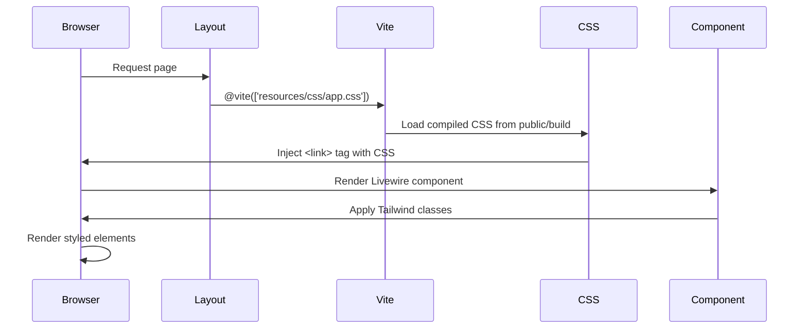

# Design Document - Schedule CSS Fix

## Overview

Masalah CSS pada halaman schedule disebabkan oleh beberapa faktor potensial yang perlu diinvestigasi dan diperbaiki secara sistematis. Berdasarkan analisis kode, sistem menggunakan Tailwind CSS v4 dengan Vite sebagai build tool. Halaman-halaman yang bermasalah adalah Livewire components yang menggunakan utility classes dari Tailwind.

Solusi yang akan diterapkan meliputi:
1. Verifikasi dan perbaikan konfigurasi Tailwind CSS content paths
2. Memastikan Vite build process mengcompile semua CSS yang diperlukan
3. Validasi bahwa CSS assets di-load dengan benar di browser
4. Perbaikan class names yang mungkin tidak valid atau typo
5. Memastikan Alpine.js dan Livewire bekerja dengan baik untuk interactive elements

## Architecture

### Component Structure

```
┌─────────────────────────────────────────┐
│         Browser (Client Side)           │
│  ┌───────────────────────────────────┐  │
│  │   Blade Templates                 │  │
│  │   - schedule-calendar.blade.php   │  │
│  │   - my-schedule.blade.php         │  │
│  │   - availability-manager.blade.php│  │
│  └───────────────┬───────────────────┘  │
│                  │                       │
│  ┌───────────────▼───────────────────┐  │
│  │   Compiled CSS Assets             │  │
│  │   - app-Ccs_r2xt.css (Tailwind)  │  │
│  │   - Font Awesome CDN              │  │
│  └───────────────┬───────────────────┘  │
│                  │                       │
│  ┌───────────────▼───────────────────┐  │
│  │   JavaScript Assets               │  │
│  │   - Alpine.js (for x-data)        │  │
│  │   - Livewire.js (for wire:)       │  │
│  └───────────────────────────────────┘  │
└─────────────────────────────────────────┘
                  │
┌─────────────────▼───────────────────────┐
│         Build Process (Vite)            │
│  ┌───────────────────────────────────┐  │
│  │   Source Files                    │  │
│  │   - resources/css/app.css         │  │
│  │   - tailwind.config.js            │  │
│  └───────────────┬───────────────────┘  │
│                  │                       │
│  ┌───────────────▼───────────────────┐  │
│  │   Tailwind CSS Compiler           │  │
│  │   - Scan content paths            │  │
│  │   - Generate utility classes      │  │
│  │   - Purge unused classes          │  │
│  └───────────────┬───────────────────┘  │
│                  │                       │
│  ┌───────────────▼───────────────────┐  │
│  │   Output to public/build/         │  │
│  └───────────────────────────────────┘  │
└─────────────────────────────────────────┘
```

### CSS Loading Flow



## Components and Interfaces

### 1. Tailwind Configuration

**File:** `tailwind.config.js`

**Current State:**
- Content paths include: `./resources/**/*.blade.php`, `./resources/**/*.js`, `./resources/**/*.vue`, `./app/Livewire/**/*.php`
- Custom color palette defined
- Tailwind Forms plugin included

**Potential Issues:**
- Content paths mungkin tidak mencakup semua file yang menggunakan Tailwind classes
- Purge process mungkin menghapus classes yang sebenarnya digunakan

**Solution:**
- Verifikasi bahwa semua schedule blade files tercakup dalam content paths
- Pastikan dynamic classes (jika ada) di-safelist
- Validasi bahwa build process menemukan semua classes yang digunakan

### 2. Vite Configuration

**File:** `vite.config.js`

**Current State:**
- Laravel Vite plugin configured
- Tailwind CSS Vite plugin included
- Refresh paths include `resources/views/**` dan `app/Livewire/**`

**Potential Issues:**
- Build output mungkin tidak ter-refresh setelah perubahan
- CSS chunks mungkin tidak di-load dengan benar

**Solution:**
- Ensure build process runs successfully
- Verify manifest.json is generated correctly
- Check that CSS files are accessible in public/build directory

### 3. Layout Template

**File:** `resources/views/layouts/app.blade.php`

**Current State:**
- Uses `@vite(['resources/css/app.css'])` to load CSS
- Font Awesome loaded from CDN
- Alpine.js included via app.js

**Potential Issues:**
- Vite directive mungkin tidak resolve ke file yang benar
- CSS load order mungkin bermasalah
- CDN resources mungkin blocked atau failed to load

**Solution:**
- Verify Vite manifest resolves correctly
- Check browser console for CSS loading errors
- Ensure CDN resources are accessible

### 4. Schedule Components

**Files:**
- `resources/views/livewire/schedule/schedule-calendar.blade.php`
- `resources/views/livewire/schedule/my-schedule.blade.php`
- `resources/views/livewire/schedule/availability-manager.blade.php`

**Current State:**
- Extensive use of Tailwind utility classes
- Complex grid layouts with responsive classes
- Interactive elements with hover and transition classes
- Conditional classes using Blade directives

**Potential Issues:**
- Typos in class names
- Invalid class combinations
- Dynamic classes not being compiled
- Missing classes in Tailwind output

**Solution:**
- Audit all class names for validity
- Ensure all used classes are in Tailwind output
- Fix any syntax errors in class attributes
- Validate conditional class logic

## Data Models

### CSS Class Categories Used

1. **Layout Classes:**
   - Grid: `grid`, `grid-cols-*`, `gap-*`
   - Flexbox: `flex`, `flex-1`, `items-center`, `justify-between`, `space-x-*`
   - Spacing: `p-*`, `m-*`, `px-*`, `py-*`
   - Sizing: `w-*`, `h-*`, `min-h-*`, `max-w-*`

2. **Visual Classes:**
   - Colors: `bg-*`, `text-*`, `border-*`
   - Borders: `border`, `border-*`, `rounded-*`
   - Shadows: `shadow-*`
   - Opacity: `opacity-*`, `bg-opacity-*`

3. **Typography Classes:**
   - Size: `text-*`
   - Weight: `font-*`
   - Alignment: `text-center`, `text-left`, `text-right`

4. **Interactive Classes:**
   - Hover: `hover:*`
   - Focus: `focus:*`
   - Transitions: `transition-*`, `duration-*`, `ease-*`
   - Cursor: `cursor-pointer`

5. **Responsive Classes:**
   - Breakpoints: `md:*`, `lg:*`, `sm:*`

6. **State Classes:**
   - Disabled: `disabled:*`
   - Loading: `wire:loading.*`

## Error Handling

### Diagnostic Approach

1. **Browser Console Check:**
   - Check for CSS file loading errors (404, CORS)
   - Check for JavaScript errors that might break rendering
   - Verify that Vite manifest is loaded correctly

2. **Build Process Verification:**
   - Run `npm run build` and check for errors
   - Verify output files are generated in `public/build/`
   - Check file sizes to ensure CSS is not empty

3. **Class Name Validation:**
   - Scan all schedule blade files for class names
   - Cross-reference with Tailwind documentation
   - Identify any custom classes that need to be defined

4. **Content Path Verification:**
   - Ensure Tailwind config includes all necessary paths
   - Test with a simple class to verify scanning works
   - Check for any glob pattern issues

### Error Recovery Strategy

If CSS still doesn't work after fixes:

1. **Clear all caches:**
   - Browser cache
   - Laravel cache (`php artisan cache:clear`)
   - View cache (`php artisan view:clear`)
   - Vite cache (delete `node_modules/.vite`)

2. **Rebuild from scratch:**
   - Delete `public/build/` directory
   - Run `npm run build` again
   - Hard refresh browser (Ctrl+Shift+R)

3. **Fallback approach:**
   - Add safelist for critical classes in Tailwind config
   - Use CDN version of Tailwind temporarily for testing
   - Inline critical CSS if necessary

## Testing Strategy

### 1. Build Process Testing

**Objective:** Verify that CSS is compiled correctly

**Steps:**
1. Run `npm run build`
2. Check that `public/build/assets/app-*.css` exists
3. Verify file size is reasonable (>50KB for full Tailwind)
4. Inspect CSS file content for schedule-related classes

**Expected Result:**
- Build completes without errors
- CSS file contains all necessary utility classes
- File size indicates full compilation

### 2. Browser Loading Testing

**Objective:** Verify that CSS is loaded in browser

**Steps:**
1. Open schedule page in browser
2. Open DevTools Network tab
3. Check for CSS file requests
4. Verify CSS file loads with 200 status
5. Check Computed styles in Elements tab

**Expected Result:**
- CSS file loads successfully
- No 404 or CORS errors
- Elements have computed styles applied

### 3. Visual Regression Testing

**Objective:** Verify that styling matches design

**Steps:**
1. Compare rendered pages with expected design
2. Check layout structure (grid, flexbox)
3. Verify colors, spacing, typography
4. Test responsive behavior at different breakpoints
5. Test interactive states (hover, focus, disabled)

**Expected Result:**
- All elements are properly styled
- Layout is structured correctly
- Colors and spacing match design
- Responsive behavior works
- Interactive states have visual feedback

### 4. Component-Specific Testing

**Schedule Calendar:**
- Calendar grid renders with proper layout
- Day cells have correct styling
- Assignment cards display with colors
- Modal overlays work correctly
- Navigation buttons are styled

**My Schedule:**
- Week navigation displays correctly
- Schedule cards have shift-specific colors
- Badges render with proper styling
- Empty states show correctly

**Availability Manager:**
- Table grid renders properly
- Checkboxes have visual states
- Statistics cards display correctly
- Action buttons are styled
- Form elements work properly

### 5. Cross-Browser Testing

**Objective:** Ensure compatibility across browsers

**Browsers to test:**
- Chrome/Edge (Chromium)
- Firefox
- Safari (if available)

**Expected Result:**
- Consistent rendering across browsers
- No browser-specific CSS issues

## Implementation Notes

### Priority Order

1. **High Priority:**
   - Fix Tailwind content paths if needed
   - Rebuild CSS assets
   - Verify CSS loading in browser
   - Fix critical layout issues

2. **Medium Priority:**
   - Fix color and spacing inconsistencies
   - Ensure interactive states work
   - Test responsive behavior

3. **Low Priority:**
   - Optimize CSS file size
   - Add any missing utility classes
   - Improve transition animations

### Rollback Plan

If fixes cause new issues:
1. Revert to previous working commit
2. Apply fixes incrementally
3. Test after each change
4. Document what works and what doesn't

### Performance Considerations

- CSS file size should be reasonable (<100KB compressed)
- Avoid inline styles where possible
- Use Tailwind utilities instead of custom CSS
- Leverage browser caching for CSS assets
